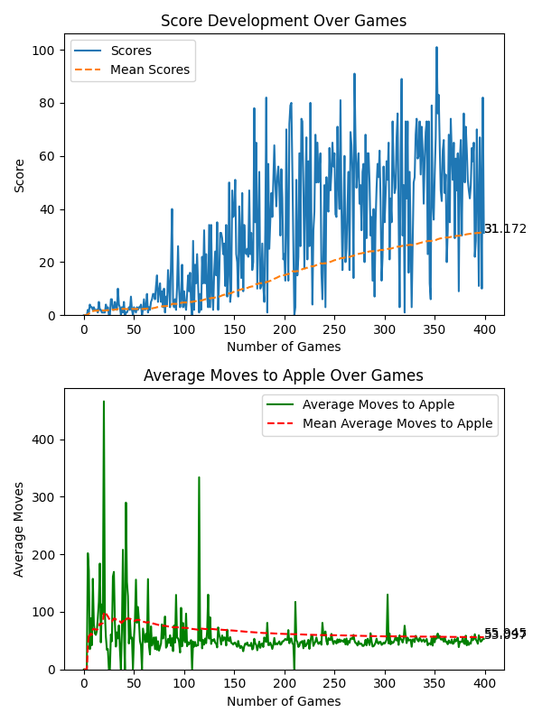

# Documenting and Analysing Results
## Introduction
In this document, I will be documenting the results of the training of the model. I will be discussing the models, their results and the changes made to the models. I will also be discussing the results of the models and the average moves to achieve the goal.

## Models and Results

## Model 1.
This is the default model provided in the video, not many changes were made to the model, only in epsilon values and
adjusting the game and rewards.

Models 1 were trained for a total of ~2000 generations.
### Model 1.0
[model10.pth](model%2Fmodel10.pth)

- **Parent**: Default
- **Initial Eplison**: 80

Default model was trained for 400 generations.
No changes were made to the model.

#### Results
- **Generations**: 400
- **Average Score**: 24.27
- **Max Score**: 93.0
- **AMTA**: --

(Graph of Average Moves not working as intended)
[model.pth](model%2Fmodel.pth)

### Model 1.1
[model11.pth](model%2Fmodel11.pth)

1.0 model was trained for 400 generations. With unmodified
model eplison, meaning **greater exploration / exploitation in beggining**

- **Parent**: Model 1.0
- **Initial Eplison**: 80

#### Results
- **Generations**: 400
- **Average Score**: 31.17
- **Max Score**: 101.0
- **AMTA**: 55.64

### Model 1.2
[model12.pth](model%2Fmodel12.pth)

- **Parent**: Model 1.0
- **Initial Eplison**: 10

1.0 model was trained for 400 generations. With modified
model eplison, meaning **fewer exploration / exploitation in beggining**

#### Results
- **Generations**: 400
- **Average Score**: 38.72
- **Max Score**: 97.0
- **AMTA**: 47.55

### Model 1.3

### Model 1.4 and 1.5

Tried some other models with similar algorithm but different
epsilon values. Results were not as satisfactory. Not much improvement

It seems it gets stuck in the average score of 80-100 not improving in generations

## Model 2
This model was trained with an addition of 4 new states. In my analysis, I found that the amount 
of states was not enough to make the AI improve enough. So I added states to represent danger not only in 10
spaces but also danger right ahead of the snake.

### Model 2.0

